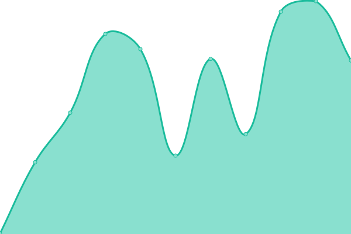

# [📈 Live Status](https://status.solpl.party): <!--live status--> **🟩 All systems operational**

This repository contains the open-source uptime monitor and status page for [솔플파티](https://about.solpl.party), powered by [Upptime](https://github.com/upptime/upptime).

With [Upptime](https://upptime.js.org), you can get your own unlimited and free uptime monitor and status page, powered entirely by a GitHub repository. We use [Issues](https://github.com/solplparty/upptime/issues) as incident reports, [Actions](https://github.com/solplparty/upptime/actions) as uptime monitors, and [Pages](https://status.solpl.party) for the status page.

<!--start: status pages-->
<!-- This summary is generated by Upptime (https://github.com/upptime/upptime) -->
<!-- Do not edit this manually, your changes will be overwritten -->
<!-- prettier-ignore -->
| URL | Status | History | Response Time | Uptime |
| --- | ------ | ------- | ------------- | ------ |
| [solplparty.com](https://solplparty.com) | 🟩 Up | [solplparty-com.yml](https://github.com/SOLPLPARTY/upptime/commits/master/history/solplparty-com.yml) | 

 308ms
     
 | 

   

| [solpl.party](https://solpl.party) | 🟩 Up | [solpl-party.yml](https://github.com/SOLPLPARTY/upptime/commits/master/history/solpl-party.yml) | 

 204ms
     
 | 

   

| [about.solpl.party](https://about.solpl.party) | 🟩 Up | [about-solpl-party.yml](https://github.com/SOLPLPARTY/upptime/commits/master/history/about-solpl-party.yml) | 

 375ms
     
 | 

   

| [culture.solpl.party](https://culture.solpl.party) | 🟩 Up | [culture-solpl-party.yml](https://github.com/SOLPLPARTY/upptime/commits/master/history/culture-solpl-party.yml) | 

 356ms
     
 | 

   

| [idoluv.me](https://idoluv.me) | 🟩 Up | [idoluv-me.yml](https://github.com/SOLPLPARTY/upptime/commits/master/history/idoluv-me.yml) | 

 539ms
     
 | 

   

| [BLUV](https://bluv.solpl.party/) | 🟩 Up | [bluv.yml](https://github.com/SOLPLPARTY/upptime/commits/master/history/bluv.yml) | 

 184ms
     
 | 

   

<!--end: status pages-->

[**Visit our status website →**](https://status.solpl.party)

## 📄 License

- Code: [MIT](./LICENSE) © [솔플파티](https://about.solpl.party)
- Data in the `./history` directory: [Open Database License](https://opendatacommons.org/licenses/odbl/1-0/)
